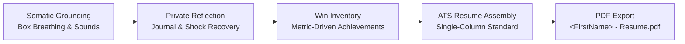

# RiseUp 🌿 

[](https://riseup.joelabc.com)
[](https://developer.mozilla.org/en-US/docs/Web/HTML)
[](https://developer.mozilla.org/en-US/docs/Web/CSS)
[](https://developer.mozilla.org/en-US/docs/Web/JavaScript)
[](https://opensource.org/licenses/MIT)
[](http://makeapullrequest.com)

> 🌐 **Live Website**: [https://riseup.joelabc.com](https://riseup.joelabc.com)
> 
> A calming, reassuring, and evidence-based web resource designed to help professionals navigate unexpected job loss, layoff shock, and career transitions with emotional grounding, structured action, and an interactive real-time ATS resume builder with print-ready PDF export.

---

## 📖 Table of Contents

- [Overview & Philosophy](#-overview--philosophy)
- [Key Features](#-key-features)
  - [1. Calming Hero & Box Breathing Guide](#1-calming-hero--box-breathing-guide)
  - [2. Ambient Soundscape Generator](#2-ambient-soundscape-generator)
  - [3. Structured 4-Step Healing Framework](#3-structured-4-step-healing-framework)
  - [4. Interactive ATS Resume Builder](#4-interactive-ats-resume-builder)
  - [5. Print-Ready PDF Export Engine](#5-print-ready-pdf-export-engine)
  - [6. Curated Video Library (Inspiring Voices)](#6-curated-video-library-inspiring-voices)
  - [7. Mentorship & Community Outreach](#7-mentorship--community-outreach)
- [Getting Started & Local Setup](#-getting-started--local-setup)
  - [Prerequisites](#prerequisites)
  - [Option A: Direct Browser Launch](#option-a-direct-browser-launch-no-installation)
  - [Option B: Local Web Server (Recommended)](#option-b-local-web-server-recommended)
- [How to Use the Website Properly](#-how-to-use-the-website-properly)
  - [Recommended User Journey](#recommended-user-journey)
  - [Mastering the Resume Builder](#mastering-the-resume-builder)
  - [Optimal PDF Export Settings](#optimal-pdf-export-settings)
- [Project Architecture & Directory Structure](#-project-architecture--directory-structure)
- [Design System & Accessibility](#-design-system--accessibility)
- [Contributing](#-contributing)
- [License](#-license)

---

## 🌿 Overview & Philosophy

Career disruptions are among the most stressful life events an adult can experience. Traditional career platforms often induce anxiety with corporate jargon, aggressive upselling, and cluttered interfaces.

**RiseUp** was crafted from the ground up to be a digital sanctuary:
* **Zero telemetry or dark patterns**: Your thoughts and resume entries remain private on your device.
* **Evidence-based somatic calming**: Integrated 4-4-4-4 box breathing with visual pacing and Web Audio soundscapes.
* **Clarity before velocity**: Ground your nervous system first, extract career wins second, and assemble an applicant-tracking-system (ATS) friendly resume third.



---

## ✨ Key Features

### 1. Calming Hero & Box Breathing Guide
- **Hero Carousel**: Hand-picked perspective affirmations and grounding reminders.
- **Interactive Box Breathing Modal**: Guided 4-4-4-4 cycle (Inhale, Hold, Exhale, Hold) with dynamic SVG doughnut progress ring, countdown timer, and soft organic pulsing orb.

### 2. Ambient Soundscape Generator
- Built using the native **Web Audio API** (synthesized white noise, pink noise, filtered rain, ocean waves, and forest frequencies) without loading external heavy MP3 files.
- Operates offline and respects audio device volume and mute toggles.

### 3. Structured 4-Step Healing Framework
- **Step 1 — Immediate Emotional Grounding**: Concrete dos and don'ts for the first 72 hours, severance checklist, and a private browser-persisted journal (`localStorage`).
- **Step 2 — Uncover Your Wins**: Guided prompts to extract quantitative achievements and impact statements. Direct "Add to Highlights" buttons inject prompts straight into your resume.
- **Step 3 — ATS Resume Builder**: Streamlined form editor tailored specifically to pass applicant tracking systems with zero parsing errors.
- **Step 4 — Next Moves & Community**: Practical guide on networking, mentorship outreach, and interview readiness.

### 4. Interactive ATS Resume Builder
- **Clean Single-Column Layout**: Guaranteed maximum ATS machine parseability (no tables, complex multi-column wraps, or unreadable graphics).
- **Multi-Employer Support**: Dynamically add, edit, or remove past job positions.
- **Active Hyperlinks**: Clickable contact bar items (`tel:`, `mailto:`, and LinkedIn links) that function both on web and inside generated PDFs.
- **Live Two-Way Synchronization**: Form edits instantly reflect in both the internal state and preview modal.

### 5. Print-Ready PDF Export Engine
- **Dynamic File Naming**: Automatically titles the document and suggested PDF export file as `<First Name> - Resume.pdf` (e.g., `Jane - Resume.pdf`).
- **Multi-Page Pure White Canvas**: Automated page-height calculation ensuring Page 2, Page 3, etc., render with immaculate white backgrounds.
- **Edge Margin & Page Break Protection**: Tailored `@media print` rules enforce `0.5in 0.55in` margins and prevent awkward breaks inside employment blocks.

### 6. Curated Video Library (Inspiring Voices)
Handpicked talks embedded in a distraction-free modal:
1. **Steve Jobs** — *Connecting the Dots in Setbacks* (Stanford Commencement)
2. **Simon Sinek** — *Finding Your Purpose & Next Direction* (High Performance)
3. **Brené Brown** — *The Power of Self-Compassion & Vulnerability* (TED)
4. **Jordan Peterson** — *Create a Daily Schedule & Stick To It* (Practical Structure)
5. **Harvard Business Review** — *Identity Crisis: Don't Define Yourself by Your Job*
6. **Oliver Burkeman** — *5 Time Management Principles for Transitions* (BBC Maestro)

### 7. Mentorship & Community Outreach
- Responsive mentorship contact form with topic categorizations (Resume Review, Coffee Chat, Mock Interview, Listening Ear).
- Toast feedback system informing users of submission status without jarring page reloads.

---

## 🚀 Getting Started & Local Setup

RiseUp is intentionally constructed with **Vanilla HTML5, CSS3, and ES6 JavaScript**. It requires **no build tools, no `npm install`, and no third-party framework overhead**.

### Prerequisites
A modern web browser supporting ES6 JavaScript and CSS Grid:
* Google Chrome (v90+)
* Apple Safari (v14+)
* Mozilla Firefox (v88+)
* Microsoft Edge (v90+)

---

### Option A: Direct Browser Launch (No Installation)
1. Clone or download this repository:
   ```bash
   git clone https://github.com/joelabc/riseUp.git
   ```
2. Navigate into the directory:
   ```bash
   cd riseUp
   ```
3. Double-click `index.html` or open it directly in your browser:
   * **macOS**: `open index.html`
   * **Linux**: `xdg-open index.html`
   * **Windows**: `start index.html`

---

### Option B: Local Web Server (Recommended)
Running through a lightweight local server is recommended for the cleanest YouTube embed playback and Web Audio API permissions.

#### Using Python 3 (Installed by default on macOS and most Linux distributions):
```bash
# Start server on port 8000
python3 -m http.server 8000
```
Open [http://localhost:8000](http://localhost:8000) in your browser.

#### Using Node.js:
```bash
# Using npx (no permanent installation required)
npx serve .
```
Or with live reload:
```bash
npx live-server
```

#### Using VS Code:
Install the **Live Server** extension (by Ritwick Dey), right-click `index.html`, and select **Open with Live Server**.

---

## 🧭 How to Use the Website Properly

### Recommended User Journey

```
┌─────────────────┐       ┌─────────────────┐       ┌─────────────────┐       ┌─────────────────┐
│   1. Ground     │  ───> │   2. Reflect    │  ───> │   3. Build      │  ───> │   4. Export     │
│   Box Breathing │       │   Record Wins   │       │   ATS Resume    │       │   Print to PDF  │
│   & Soundscape  │       │   & Journal     │       │   Live Preview  │       │   Save as File  │
└─────────────────┘       └─────────────────┘       └─────────────────┘       └─────────────────┘
```

1. **Start with Nervous System Regulation**:
   * Click **"Breathe & Reset"** in the top navigation or hero section.
   * Follow the 4-4-4-4 rhythm for 2–3 minutes to quiet acute fight-or-flight reactions.
   * Select a calming ambient sound (Rain or Ocean) to establish focus.
2. **Review the 72-Hour Action Plan**:
   * Scroll down to **Step 1 (First 72 Hours)**.
   * Review what to pause (don't send angry emails, don't spam 100 job applications) and what to verify (severance paperwork, healthcare continuation, references).
   * Use the private **Journal** to process emotions. Entries are saved locally to your browser.
3. **Capture Your Accomplishments**:
   * In **Step 2 (Uncover Your Wins)**, answer the impact prompts.
   * Click any prompt chip (e.g. *Delivered under budget*, *Mentored teammates*) to automatically pipe impact bullets into your resume.
4. **Draft Your ATS Resume**:
   * Navigate to **Step 3 (Resume Builder)**.
   * Fill in your contact details, summary, and work experience.
   * Use the **"+ Add Another Employer"** button if you have multiple positions.

---

### Mastering the Resume Builder

> [!TIP]
> **ATS Optimization Rules Applied Automatically**:
> - Standard, widely readable fonts (`system-ui`, `-apple-system`, `Segoe UI`, `Roboto`).
> - No multi-column layouts, graphics, icons, or floating text boxes that confuse parsers.
> - Clear, semantic section dividers (`SUMMARY`, `PROFESSIONAL EXPERIENCE`, `SKILLS`, `EDUCATION`).
> - Standard chronological bullet hierarchy.

* **Live First Name File Title**: As you type your name (e.g. *Alex Smith*), the system dynamically formats the preview modal and print file title to `Alex - Resume.pdf`.
* **Contact Hyperlinks**: When you input your phone number, email address, or LinkedIn username/URL, the preview builds active `tel:`, `mailto:`, and HTTPS web links that can be tapped directly from the resulting PDF.
* **Collapsible Form Section on Mobile**: On mobile devices, tap the accordion bar to expand or collapse the editor and review your changes cleanly.

---

### Optimal PDF Export Settings

When you click **"Preview & Print PDF"**, a modal lightbox will present your formatted document. Click the **"Print"** button inside the modal (or press `Cmd+P` / `Ctrl+P`).

> [!IMPORTANT]
> To achieve the cleanest, border-free, multi-page PDF output, configure your browser's print dialog as follows:

| Setting | Recommended Value | Why |
|---|---|---|
| **Destination** | **Save as PDF** | Generates a clean digital document |
| **Pages** | **All** | Automatically scales across pages |
| **Paper Size** | **Letter** (US) or **A4** (International) | Matches ATS standard document dimensions |
| **Margins** | **None** or **Default** | The built-in CSS `@page` margin (`0.5in 0.55in`) already specifies perfect margins |
| **Background Graphics** | **Checked / Enabled** | Ensures subtle divider lines and skills badge backgrounds are visible |
| **Headers & Footers** | **Unchecked / Disabled** | Prevents the browser from printing URL strings, dates, and page numbers at the top/bottom |

When saved, your browser will automatically propose `<YourFirstName> - Resume.pdf` as the filename.

---

## 📁 Project Architecture & Directory Structure

```
riseUp/
├── index.html           # Semantic single-page application structure
├── styles.css           # Comprehensive design system, theme tokens, and print engine
├── app.js               # Reactive logic, audio synthesis, resume pagination, and title hooks
├── favicon.svg          # Master vector RiseUp logo favicon
├── favicon.ico          # Multi-resolution fallback favicon
├── assets/
│   └── images/          # RiseUp icon suite and calming photography
│       ├── favicon.svg
│       ├── favicon-32x32.png
│       ├── favicon-192x192.png
│       ├── apple-touch-icon.png
│       ├── calm_lake_sunrise.jpg
│       ├── growth_plant_sunlight.jpg
│       ├── peaceful_horizon_path.jpg
│       └── supportive_hands_warmth.jpg
└── README.md            # Project setup, philosophy, and documentation
```

### Script & Styling Modules in `app.js` and `styles.css`:
1. **Theme Switcher**: Dark / Light theme detection with `localStorage` persistence.
2. **Hero Perspective Slider**: Touch- and click-responsive carousel with navigation dots.
3. **Breathing Engine**: SVG circle circumference math (`strokeDashoffset`), phase coordinator, and audio timer.
4. **Web Audio Synthesizer**: Custom oscillator nodes and brownian/pink noise filters generating continuous ambient soundscapes.
5. **Multi-Page Pagination Calculator**: Real-time DOM scroll height measurement inserting page breaks and ensuring full white paper backgrounds on page 2+.
6. **PDF Title Lifecycle**: Dynamic `document.title` and `#resume-modal-title` synchronization across `beforeprint`, `afterprint`, and modal triggers.
7. **Video Gallery Controller**: YouTube iframe launcher with lazy loading and backdrop dismissal.
8. **Print Engine (`@media print`)**: Strict page breaks, margin guards, and concealment of web navigation controls.

---

## 🎨 Design System & Accessibility

- **Color Palette**:
  - Deep Sanctuary Charcoal: `#0e131b`
  - Calming Sage Accent: `#52a87a` / `#86efac`
  - Warm Sand Muted: `#e8e4dc`
  - Slate Borders: `rgba(255, 255, 255, 0.08)`
- **Typography**:
  - Headings: `Fraunces` (warm, literary serif expressing dignity and hope)
  - Interface & Body: `Plus Jakarta Sans` (modern, legible geometric sans-serif)
  - Resume ATS Body: System native fonts (`system-ui`, `-apple-system`, `Segoe UI`, `Roboto`)
- **Accessibility (a11y)**:
  - All interactive buttons include `aria-label` tags.
  - High contrast ratios (WCAG 2.1 AA compliant) across both dark and light themes.
  - Full keyboard navigation support (Escape to dismiss modals, Tab-traversable inputs).

---

## 🤝 Contributing

Contributions that enhance user calm, accessibility, and ATS compatibility are welcome!

1. Fork the project repository.
2. Create your feature branch:
   ```bash
   git checkout -b feature/mindful-improvement
   ```
3. Commit your changes:
   ```bash
   git commit -m "feat: enhance mobile pagination for 3-page resumes"
   ```
4. Push to your branch:
   ```bash
   git push origin feature/mindful-improvement
   ```
5. Open a Pull Request with a clear description and screenshots.

---

## 📄 License

Distributed under the **MIT License**. You are free to use, adapt, and share this resource for personal and commercial initiatives.

---

<div align="center">
  <sub>Built with care, empathy, and resilience. If you are navigating a transition today: breathe, reflect, and rise up.</sub>
</div>
